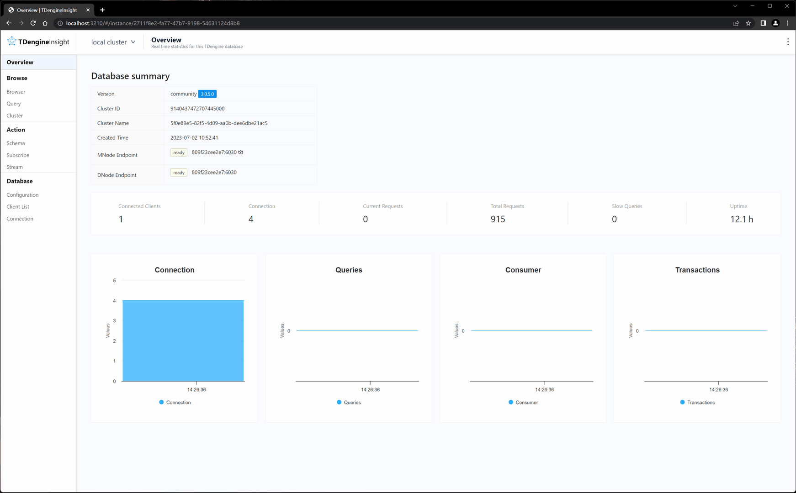

# TDengineInsight

TDengineInsight is a visual tool that provides capabilities to design, query, and interact with your TDengine data.
> NOTE: TDengine 2.x version untested

# Preview



# Get started

## Usage

```shell
docker run -d --name tdengineinsight \
    -p 3210:3210 \
    -v tdengineinsight:/opt/TDengineInsight/data \
    slothsio/tdengineinsight:1.0.0-rc1
```
Open [http:://localhost:3210](http:://localhost:3210) in your browser

## Build from source

```shell
git clone --recursive https://github.com/slothsclub/TDengineInsight
cd web
npm install
VITE_OUT_DIR=../src/main/resources/static VITE_ROUTE_MODE=hash VITE_API_BASE_URL=/api npm run build

cd ..
./gradle build
docker build .
```

# Development

## Prerequisites

* JDK 17
* Node 16
* TDengine 3.x

## Launch a test cluster

```shell
docker compose -f docker-tdengine-cluster.yml up -d
```

## Run API server
```shell
git clone https://github.com/slothsclub/TDengineInsight.git
cd TDengineInsight
./gradlew bootRun
```
## Run web UI
```shell
git clone https://github.com/slothsclub/tdengineinsight-web.git
cd tdengineinsight-web
npm install
VITE_API_BASE_URL=http://localhost:3210/api npm run dev
```

# Feedback

* File a [bug](https://github.com/slothsclub/TDengineInsight/issues)

